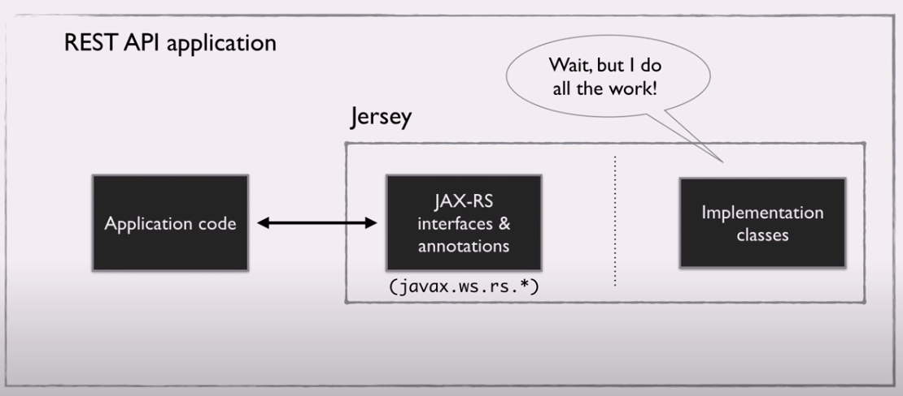

### What is JAX-RS?
JAX-RS is a common API for building production grade REST APIs. The JAX-RS API is a bunch of interfaces and annotations. This is the core of learning how to write REST APIs.

### What is Jersey?
While JAX-RS has a bunch of interfaces and annotations, it does not have functionality (implemented classes). You need classes that implement these interfaces and read these annotations. The libraries look at your code and see where you have called the JAX RS APIs, and in this way they do the actual useful heavy-lifting work. The good thing is every JAX-RS library comes with a copy of the JAX-RS base API interfaces and annotations. Jersey is also called a reference implementation of JAX-RS. It's a model implementation for JAX-RS.

### What are some common libraries?
* Jersey
* RESTLet
* RESTEasy
* Apache Wink